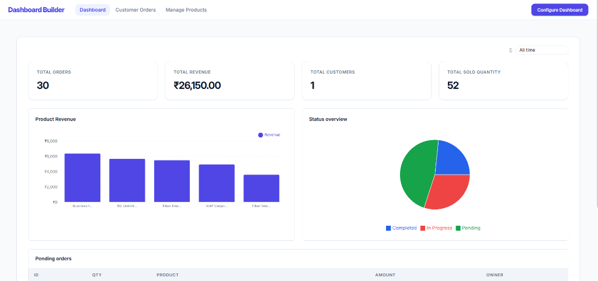
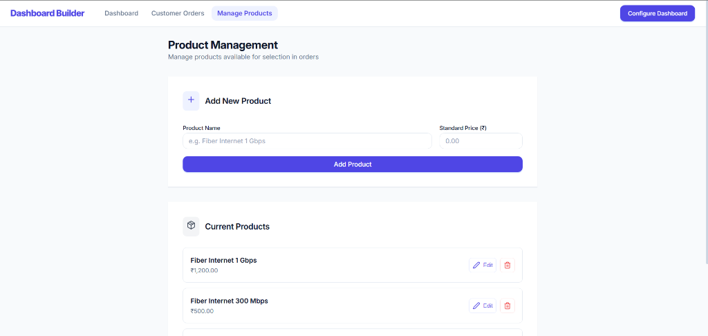
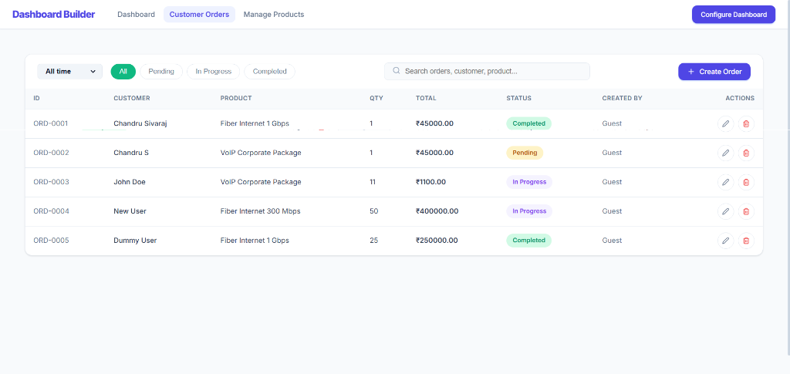
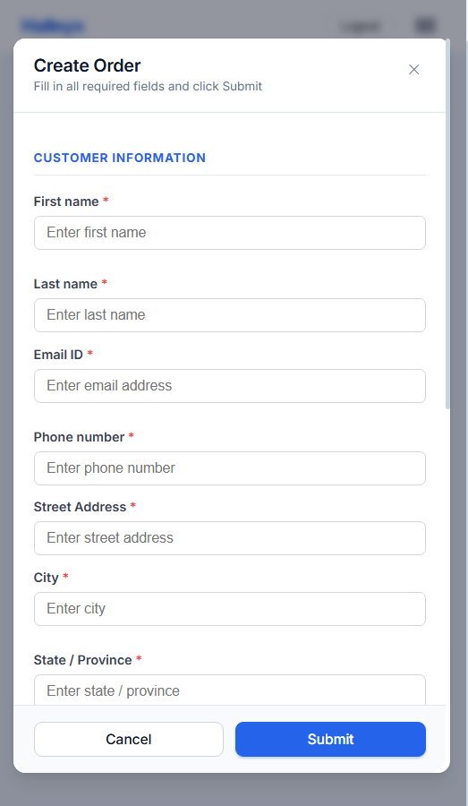
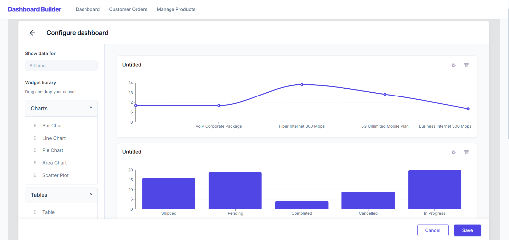
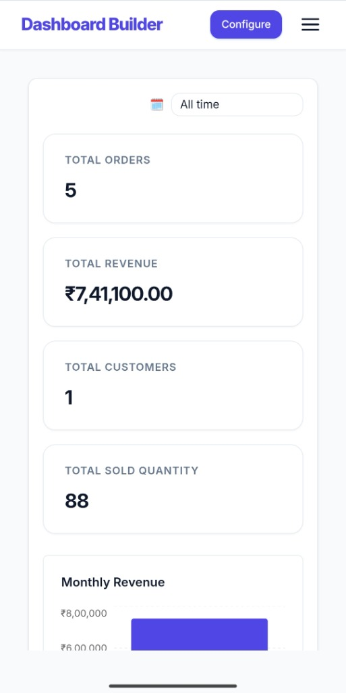
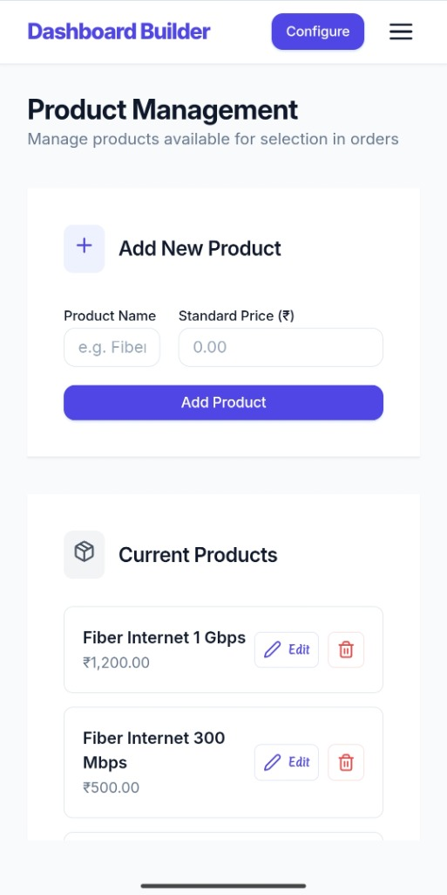
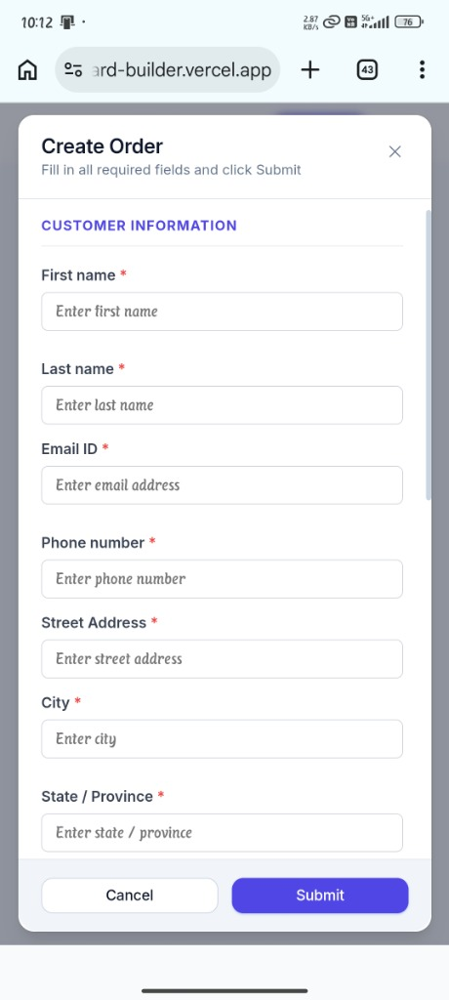
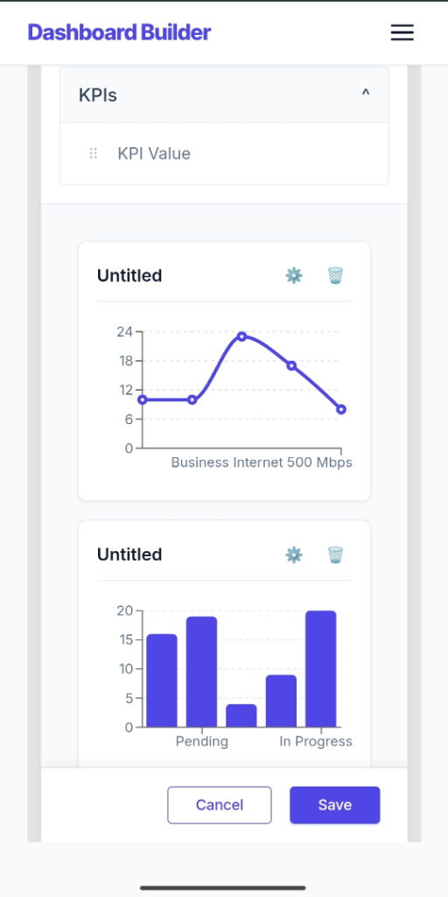

# 🚀 Halleyx - Dashboard Builder

A world-class, full-stack ERP-style dashboard for managing customer orders and viewing real-time analytics. Built with a focus on **security**, **visual excellence**, and **unmatched performance**.



## 🌟 Visual Overview

### 🖥️ Desktop Experience

| **Main Dashboard** | **Product Management** |
|:---:|:---:|
|  |  |

| **Customer Orders** | **Order Creation** |
|:---:|:---:|
|  |  |

| **Dashboard Customizer** |
|:---:|
|  |

### 📱 Mobile Excellence

| **Mobile Dashboard** | **Mobile Products** |
|:---:|:---:|
|  |  |

| **Mobile Orders** | **Mobile Configure** |
|:---:|:---:|
|  |  |

### 📹 Project Execution


## 🚀 Key Features

- **🔐 Secure Authentication:** Enterprise-grade JWT authentication with role-based access control (RBAC) and hashed password storage using Bcrypt.
- **🎨 Premium UI/UX:** A sleek "Deep Blue & White" minimal design system, prioritizing clarity and professional aesthetics.
- **📊 Real-Time Analytics:** Interactive charts and KPI cards that refresh automatically as data changes, powered by `Recharts`.
- **🛠️ Dashboard Customizer:** A flexible drag-and-drop configuration interface to tailor your dashboard layout to your specific needs.
- **📦 Advanced Order Management:** Robust CRUD operations for products and customer orders with automated price calculations and detailed tracking.
- **📱 Fully Responsive:** Optimized for desktop, tablet, and mobile, ensuring a consistent experience everywhere.

## 🛠️ Tech Stack

### Frontend
- **React 18 (Vite)** – High-performance, reactive UI.
- **Recharts** – Stunning data visualizations.
- **Axios** – Secure API communication with interceptors.
- **Vanilla CSS** – A bespoke, high-performance design system without framework bloat.

### Backend
- **Flask (Python)** – Scalable and efficient REST API.
- **MongoDB Atlas** – Reliable, cloud-native NoSQL database.
- **Flask-JWT-Extended** – Robust session and security management.
- **Bcrypt** – Standard-setting password encryption.

---

## 📖 Getting Started

### 1. Prerequisites
- Python 3.9+
- Node.js 18+ & npm
- MongoDB Atlas cluster URI

### 2. Backend Setup
```bash
cd backend
python -m venv venv
source venv/bin/activate  # Windows: venv\Scripts\activate
pip install -r requirements.txt
# Configure your .env file with MONGO_URI and JWT_SECRET_KEY
python app.py
```

### 3. Frontend Setup
```bash
cd frontend
npm install
npm run dev
```


## 📁 Project Structure

- `📂 /backend`: Flask API logic, models, and authentication.
- `📂 /frontend`: React source code, custom hooks, and styles.
- `📂 /screenshots`: High-resolution visual assets.

